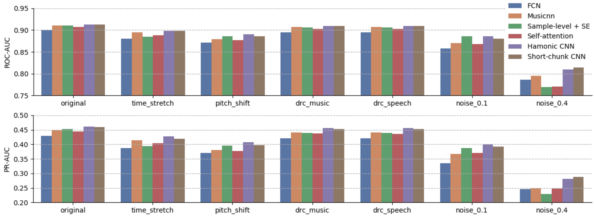

# State-of-the-art Music Tagging Models

[](https://opensource.org/licenses/MIT)

PyTorch implementation of state-of-the-art music tagging models :notes:

[Demo and Docker image on Replicate](https://replicate.ai/minzwon/sota-music-tagging-models)

## Reference

**Evaluation of CNN-based Automatic Music Tagging Models**, SMC 2020 [[arxiv](https://arxiv.org/abs/2006.00751)]

-- Minz Won, Andres Ferraro, Dmitry Bogdanov, and Xavier Serra

**TL;DR**

- If your dataset is relatively small: take advantage of domain knowledge using Musicnn.
- If you want a simple but the best performing model: Short-chunk CNN with Residual connection (so-called _vgg_-ish model with a small receptive field)
- If you want the best performance with generalization ability: Harmonic CNN

## Available Models

- **FCN** : Automatic Tagging using Deep Convolutional Neural Networks, Choi et al., 2016 [[arxiv](https://arxiv.org/abs/1606.00298)]
- **Musicnn** : End-to-end Learning for Music Audio Tagging at Scale, Pons et al., 2018 [[arxiv](https://arxiv.org/abs/1711.02520)]
- **Sample-level CNN** : Sample-level Deep Convolutional Neural Networks for Music Auto-tagging Using Raw Waveforms, Lee et al., 2017 [[arxiv](https://arxiv.org/abs/1703.01789)]
- **Sample-level CNN + Squeeze-and-excitation** : Sample-level CNN Architectures for Music Auto-tagging Using Raw Waveforms, Kim et al., 2018 [[arxiv](https://arxiv.org/pdf/1710.10451.pdf)]
- **CRNN** : Convolutional Recurrent Neural Networks for Music Classification, Choi et al., 2016 [[arxiv](https://arxiv.org/abs/1609.04243)]
- **Self-attention** : Toward Interpretable Music Tagging with Self-Attention, Won et al., 2019 [[arxiv](https://arxiv.org/abs/1906.04972)]
- **Harmonic CNN** : Data-Driven Harmonic Filters for Audio Representation Learning, Won et al., 2020 [[pdf](https://ccrma.stanford.edu/~urinieto/MARL/publications/ICASSP2020_Won.pdf)]
- **Short-chunk CNN** : Prevalent 3x3 CNN. So-called _vgg_-ish model with a small receptieve field.
- **Short-chunk CNN + Residual** : Short-chunk CNN with residual connections.

## Requirements

```
conda create -n YOUR_ENV_NAME python=3.7
conda activate YOUR_ENV_NAME
pip install -r requirements.txt
```

## Preprocessing

STFT will be done on-the-fly. You only need to read and resample audio files into `.npy` files.

`python3 preprocessing/read.py run YOUR_DATA_PATH`

## Training

`python3 training/main.py --data_path YOUR_DATA_PATH`

Options

```
'--num_workers', type=int, default=0
'--dataset', type=str, default='mtat', choices=['mtat', 'msd', 'jamendo', 'gtzan']
'--model_type', type=str, default='fcn',
				choices=['fcn', 'musicnn', 'crnn', 'sample', 'se', 'short', 'short_res', 'attention', 'hcnn']
'--n_epochs', type=int, default=200
'--batch_size', type=int, default=16
'--lr', type=float, default=1e-4
'--use_tensorboard', type=int, default=1
'--model_save_path', type=str, default='./models'
'--model_load_path', type=str, default='./models'
'--load_model', type=int, default=1
'--data_path', type=str, default='./data'
'--log_step', type=int, default=20
```

## Evaluation

`python3 training/eval.py --data_path YOUR_DATA_PATH`

Options

```
'--num_workers', type=int, default=0
'--dataset', type=str, default='mtat', choices=['mtat', 'msd', 'jamendo', 'gtzan']
'--model_type', type=str, default='fcn',
                choices=['fcn', 'musicnn', 'crnn', 'sample', 'se', 'short', 'short_res', 'attention', 'hcnn']
'--batch_size', type=int, default=16
'--model_load_path', type=str, default='./models'
'--data_path', type=str, default='./data'
```

## Performance Comparison

Performances of SOTA models

<figure>

Performances with perturbed inputs



## Citation

```
@inproceedings{won2020eval,
  title={Evaluation of CNN-based automatic music tagging models},
  author={Won, Minz and Ferraro, Andres and Bogdanov, Dmitry and Serra, Xavier},
  booktitle={Proc. of 17th Sound and Music Computing},
  year={2020}
}
```

## License

```
MIT License

Copyright (c) 2020 Music Technology Group, Universitat Pompeu Fabra. Code developed by Minz Won.

Permission is hereby granted, free of charge, to any person obtaining a copy
of this software and associated documentation files (the "Software"), to deal
in the Software without restriction, including without limitation the rights
to use, copy, modify, merge, publish, distribute, sublicense, and/or sell
copies of the Software, and to permit persons to whom the Software is
furnished to do so, subject to the following conditions:

The above copyright notice and this permission notice shall be included in all
copies or substantial portions of the Software.

THE SOFTWARE IS PROVIDED "AS IS", WITHOUT WARRANTY OF ANY KIND, EXPRESS OR
IMPLIED, INCLUDING BUT NOT LIMITED TO THE WARRANTIES OF MERCHANTABILITY,
FITNESS FOR A PARTICULAR PURPOSE AND NONINFRINGEMENT. IN NO EVENT SHALL THE
AUTHORS OR COPYRIGHT HOLDERS BE LIABLE FOR ANY CLAIM, DAMAGES OR OTHER
LIABILITY, WHETHER IN AN ACTION OF CONTRACT, TORT OR OTHERWISE, ARISING FROM,
OUT OF OR IN CONNECTION WITH THE SOFTWARE OR THE USE OR OTHER DEALINGS IN THE
SOFTWARE.
```

## Upcoming Models

Available upon request.

minz.won@upf.edu
